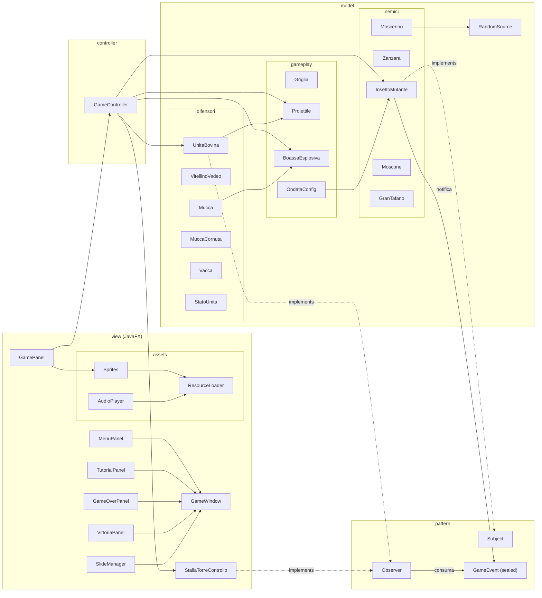
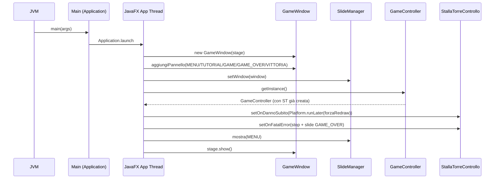
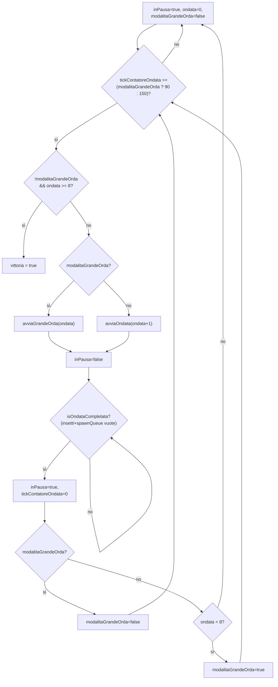
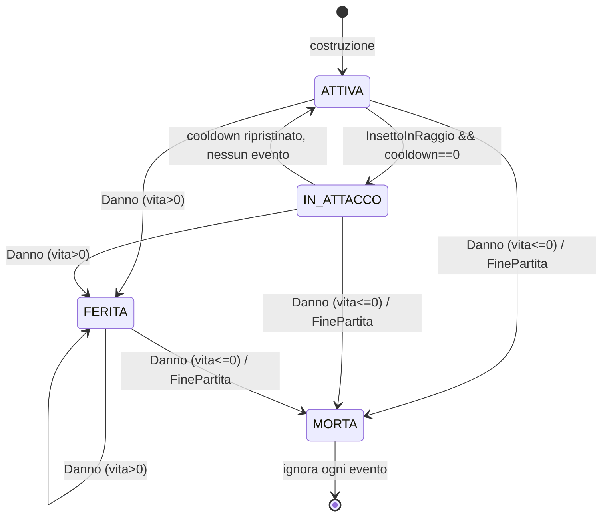
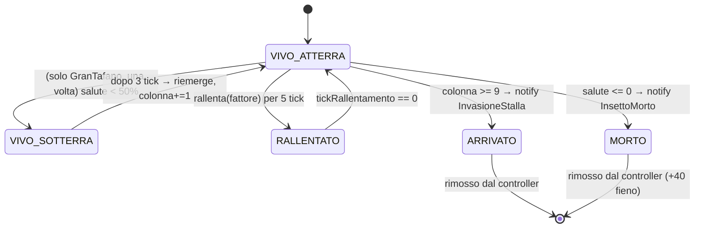

# Documentazione tecnica — Mucche alla Riscossa

> Documento di riferimento interno al progetto. Descrive l'architettura,
> i moduli, i pattern, i flussi di gioco e le scelte implementative non
> ovvie. È pensato per affiancare la lettura del codice: i riferimenti
> sono al nome di file/classe/metodo (niente numeri di riga, così resta
> robusto rispetto ai refactor).

Indice:

1. [Sguardo d'insieme](#1-sguardo-dinsieme)
2. [Struttura del repository e build](#2-struttura-del-repository-e-build)
3. [Architettura MVC e diagramma dei package](#3-architettura-mvc-e-diagramma-dei-package)
4. [Modello di dominio](#4-modello-di-dominio)
   - 4.1 [Pattern: `Subject` / `Observer` / `GameEvent`](#41-pattern-subject--observer--gameevent)
   - 4.2 [`UnitaBovina` e le mucche concrete](#42-unitabovina-e-le-mucche-concrete)
   - 4.3 [`InsettoMutante` e gli insetti concreti](#43-insettomutante-e-gli-insetti-concreti)
   - 4.4 [Gameplay: `Griglia`, `Proiettile`, `BoassaEsplosiva`, `OndataConfig`](#44-gameplay-griglia-proiettile-boassaesplosiva-ondataconfig)
   - 4.5 [`RandomSource`: aleatorietà testabile](#45-randomsource-aleatorietà-testabile)
5. [Controller](#5-controller)
6. [View (JavaFX) e asset](#6-view-javafx-e-asset)
7. [Design pattern adottati](#7-design-pattern-adottati)
8. [Flussi di gioco e diagrammi di sequenza](#8-flussi-di-gioco-e-diagrammi-di-sequenza)
9. [Modello degli eventi (state diagram)](#9-modello-degli-eventi-state-diagram)
10. [Strategia di test](#10-strategia-di-test)
11. [Decisioni progettuali e trade-off](#11-decisioni-progettuali-e-trade-off)
12. [Estensibilità e punti aperti](#12-estensibilità-e-punti-aperti)

---

## 1. Sguardo d'insieme

**Mucche alla Riscossa** è un tower defense bovino scritto in **Java 21**
con interfaccia **JavaFX**. Il giocatore schiera unità bovine
(`VitellinoVedeo`, `Mucca`, `MuccaCornuta`, `Vacca`) su una griglia 5×10
per fermare ondate crescenti di insetti mutanti (`Zanzara`, `Moscerino`,
`Moscone`, `GranTafano`). La logica di gioco è retta da un game-loop a
~30 FPS basato su `AnimationTimer` (vedi `GamePanel#gameTimer`) che
muove i nemici, gestisce attacchi, trappole, blocchi corpo-a-corpo,
generazione passiva di "balle di fieno" e progressione delle 8 ondate
intervallate da Grandi Orde.

Il fil rouge architetturale è il pattern **Observer** in forma type-safe:
gli `InsettoMutante` sono `Subject`, mucche e stalla sono `Observer`, e
gli eventi viaggiano come `GameEvent` (sealed interface + record),
eliminando qualunque protocollo a stringhe.

---

## 2. Struttura del repository e build

```text
mucche-alla-riscossa/
├── pom.xml                        Maven, JDK 21, JavaFX 21.0.4, Batik, JUnit 5.11.3
├── README.md                      panoramica, regole di gioco, build
├── LICENSE
├── docs/
│   ├── uml.md                     UML sintetico (Mermaid)
│   └── CODEBASE.md                questo documento
├── .github/workflows/ci.yml       CI: build + test su Ubuntu / JDK 21
├── assets/sprites/                sorgenti SVG/PNG di riferimento
├── src/main/resources/
│   ├── sprites/                   asset PNG/SVG caricati a runtime
│   └── audio/                     WAV degli effetti sonori
├── src/main/java/io.github.samuelebrusegan.muccheallariscossa/
│   ├── Main.java                  entry point JavaFX (estende Application)
│   ├── controller/GameController.java
│   ├── pattern/                   Observer, Subject, GameEvent
│   ├── model/
│   │   ├── RandomSource.java
│   │   ├── difensori/             UnitaBovina + 4 mucche + StatoUnita
│   │   ├── nemici/                InsettoMutante + 4 insetti
│   │   └── gameplay/              Griglia, Proiettile, BoassaEsplosiva, OndataConfig
│   └── view/
│       ├── GameWindow             Stage + Scene + map nome→Parent
│       ├── *Panel                 MenuPanel, TutorialPanel, GamePanel,
│       │                          GameOverPanel, VittoriaPanel
│       ├── SlideManager           navigazione fra schermate (Singleton)
│       ├── StallaTorreControllo   Observer del game state (vive nel view package)
│       └── assets/                ResourceLoader, Sprites, AudioPlayer
└── src/test/java/                 JUnit 5 (controller, integration, model, view/assets)
```

Build & run (vedi `pom.xml` e README):

```bash
mvn compile        # compila
mvn test           # esegue tutti i test JUnit 5
mvn javafx:run     # avvia il gioco (mainClass=io.github.samuelebrusegan.muccheallariscossa.Main)
```

`pom.xml` definisce `maven.compiler.source/target = 21` (necessario per
il `switch` con pattern matching su sealed interface e i record),
include `junit-jupiter-params` per i test parametrici di `OndataConfig`
e usa `javafx-maven-plugin` per il run; le dipendenze sono
`javafx-controls`, `javafx-media`, `batik-transcoder` + `batik-codec`
(per il rendering degli SVG via `ResourceLoader#svgScalato`).

---

## 3. Architettura MVC e diagramma dei package

L'organizzazione segue il triplete classico **Model / View / Controller**,
con l'aggiunta di un pacchetto `pattern` che ospita le interfacce
Observer/Subject e il tipo evento `GameEvent`:



La dipendenza è unidirezionale: `view → controller → model`. Il modello
**non** importa JavaFX né AWT. La view legge lo stato del modello via
getter del `GameController` e installa due `Runnable` di callback
(`onDannoSubito`, `onFatalError`) su `StallaTorreControllo` in `Main`.

---

## 4. Modello di dominio

### 4.1 Pattern: `Subject` / `Observer` / `GameEvent`

Tre file, un solo concetto: chi pubblica eventi (`Subject`) e chi li
consuma (`Observer`) scambiano oggetti **tipizzati** anziché stringhe.

`pattern/GameEvent.java` è una **sealed interface** che enumera i nove
record-evento possibili:

```java
public sealed interface GameEvent {
    record InsettoInRaggio(int rigaInsetto, double colonnaInsetto) implements GameEvent {}
    record Danno(int quantita)                                    implements GameEvent {}
    record FinePartita()                                          implements GameEvent {}
    record InvasioneStalla(String tipoInsetto, int idInsetto)     implements GameEvent {}
    record InsettoMorto(String tipoInsetto, int idInsetto)        implements GameEvent {}
    record DannoStalla(int quantita)                              implements GameEvent {}
    record TafanoScava(int idInsetto, boolean sotterraneo)        implements GameEvent {}
    record ZanzaraInVolo(int idInsetto, int riga)                 implements GameEvent {}
    record MoscerinoEvade(int idInsetto)                          implements GameEvent {}
}
```

Vantaggi rispetto al protocollo a stringhe (`"DANNO:50"`):

- **Tipo-sicurezza**: niente `Integer.parseInt` con `try/catch` a runtime.
- **Pattern matching esaustivo** nei consumatori (`switch` su sealed).
- **Estensibilità**: aggiungere un evento è additivo; chi non lo gestisce
  lo riceve nel ramo `default` e lo ignora.
- **Immutabilità** garantita dai `record`.

`pattern/Subject.java` è minimale e definisce solo
`attach/detach/notifyObservers(GameEvent)`. L'implementazione concreta
sta in `InsettoMutante` (§4.3).

`pattern/Observer.java` espone l'unico metodo `onEvent(GameEvent)`. Il
javadoc raccomanda di usare `switch` con pattern matching e di ignorare
gli eventi non rilevanti: è esattamente quello che fanno
`UnitaBovina.onEvent` e `StallaTorreControllo.onEvent`.

### 4.2 `UnitaBovina` e le mucche concrete

`model/difensori/UnitaBovina.java` è la classe astratta base.

- ID immutabile generato thread-safe:
  `protected final int id = NEXT_ID.getAndIncrement();` con
  `AtomicInteger NEXT_ID` statico. Garantisce univocità anche in scenari
  multi-thread (JavaFX Application Thread + eventuali test paralleli).
- Stato esplicito tramite enum `StatoUnita` (`ATTIVA`, `IN_ATTACCO`,
  `FERITA`, `MORTA`).
- Cooldown di attacco gestito a tick; `tick()` decrementa il contatore.
- `setBersaglioCorrente(InsettoMutante)`: il controller designa il
  bersaglio prima di lanciare l'evento (utile alle mucche corpo a corpo
  come la `MuccaCornuta`, che hanno bisogno di sapere quale insetto
  colpire).
- `onEvent(GameEvent)` esegue il dispatch tramite pattern matching:
  - `InsettoInRaggio` → se `cooldown == 0`, passa in `IN_ATTACCO`,
    chiama il template method astratto `attacca()`, reimposta il
    cooldown a `cooldownMax`.
  - `Danno` → applica `riceviDanno(quantita)`.
  - `FinePartita` → stato `MORTA`, non risponde più ad alcun evento.
  - default → ignorato (estensibilità).
- Una unità `MORTA` ignora qualunque evento successivo (guard a inizio
  `onEvent`).
- Le mucche producono proiettili/boasse nelle liste `proiettiliPronti` /
  `boassePronte`. Il controller le svuota ad ogni tick chiamando
  `raccogliProiettili()` / `raccogliBoasse()`.

`attacca()` è il **template method**: ogni mucca lo specializza.

| Classe          | Costo | Raggio | Vita | Cooldown | Comportamento `attacca()` |
|---|---|---|---|---|---|
| `VitellinoVedeo` | 50  | 5.0 | 100 | 9 | crea un `Proiettile` `colpisceTutti=false` con velocità −0.4 (sx) e danno 20 |
| `Mucca` (Beatrice) | 75  | 1.0 | 150 | 3 | piazza una `BoassaEsplosiva` sotto di sé (danno 50, rallentamento 30%) |
| `MuccaCornuta` (Assunta) | 125 | 0.5 | 300 | 3 | `incorna(bersaglioCorrente)` corpo a corpo, `dannoCarica = 80` |
| `Vacca`         | 200 | 8.0 | 200 | 3 | lancia un `Proiettile` `colpisceTutti=true` con velocità −3 (lancio del vitello) |

Vitello, vacca e mucca espongono getter `getUltimoProiettile()` /
`getUltimaTrappola()` come stato osservabile per i test (oltre alle
liste raccolte dal controller).

### 4.3 `InsettoMutante` e gli insetti concreti

`model/nemici/InsettoMutante.java` è il **Subject** concreto del gioco.

- ID univoco analogo a `UnitaBovina` (`AtomicInteger`).
- `colonna` è `double` perché un insetto si muove a frazione di cella
  per tick; la "stalla" è alla colonna `COLONNA_STALLA = 9`.
- `muovi()` fa il guard (vivo & non arrivato) e delega al template
  method `avanza()`. Quando `colonna >= 9` chiama `setArrivato()`, che
  notifica `GameEvent.InvasioneStalla(tipo, id)`.
- `avanza()` di default gestisce il rallentamento: se
  `tickRallentamento > 0` usa `velocita` già ridotta, decrementa il
  contatore, e al termine ripristina `velocitaBase`.
- `subisciDanno(int)` riduce `salute` e, se va a zero, notifica
  `GameEvent.InsettoMorto(tipo, id)`.
- `rallenta(double fattore)` imposta `velocita = velocitaBase * fattore`
  e `tickRallentamento = 5`.
- `notifyObservers` itera **su una copia** della lista, in modo che un
  observer possa rimuoversi durante il callback senza
  `ConcurrentModificationException`.
- `attraversaMucche()` (default `false`): override per
  Zanzara (sempre `true`, vola) e GranTafano (`true` solo se
  sotterraneo). Usato dal controller per saltare il blocco fisico.
- `dannoMorso` (default 5): quando una mucca blocca fisicamente un
  insetto, il controller fa "mordere" l'insetto applicando `Danno` alla
  mucca. La Zanzara morde poco (3), il GranTafano morde tanto (25).

Specializzazioni (i parametri sono nel costruttore della classe):

| Insetto      | Salute | Velocità | Morso | Comportamento extra |
|---|---|---|---|---|
| `Zanzara`    | 40  | 0.10  | 3  | `avanza()` chiama `volaOltreBalle()` poi `super.avanza()`; notifica `ZanzaraInVolo`; `attraversaMucche()=true` |
| `Moscerino`  | 25  | 0.13  | 5  | `subisciDanno(int)` estrae `random.nextDouble()`: se < `PROB_EVASIONE = 0.30` annulla il danno e pubblica `MoscerinoEvade(id)` |
| `Moscone`    | 200 | 0.035 | 5  | `subisciDanno(int)` riduce il danno di `spessoreGuscioNoce = 10` (clamp a 0) |
| `GranTafano` | 400 | 0.025 | 25 | sotto al 50% di salute scava **una sola volta** (`haGiaScavato`), resta 3 tick sotterraneo, riemerge `colonna += 1.0`; mentre sotterraneo è invulnerabile e attraversa le mucche |

### 4.4 Gameplay: `Griglia`, `Proiettile`, `BoassaEsplosiva`, `OndataConfig`

**`Griglia`** (`model/gameplay/Griglia.java`): tabellone 5×10
(`RIGHE = 5`, `COLONNE = 10`). Espone `isCellaLibera`, `occupa`,
`libera`, `getUnitaInCella`. Le operazioni fuori bounds sono **silenti**
(no-op / ritornano `null` o `false`), per resistenza alla GUI che potrebbe
tradurre click fuori area. NB: il `GameController` attuale tiene le
mucche in una `List` e non usa la `Griglia` per impedire piazzamenti
sovrapposti — la classe esiste e ha test propri, ma non è ancora
collegata al placement.

**`Proiettile`** (`model/gameplay/Proiettile.java`):

- campi: `danno`, `velocita` (double, può essere negativa: i bovini
  sparano verso sx), `riga` (int), `colonna` (double), `colpisceTutti`
  (bool), `attivo` (bool).
- `muovi()` somma `velocita` alla colonna; se esce dalla griglia in una
  delle due direzioni (`colonna >= COLONNE` o `colonna < 0`) si
  disattiva.
- `segnaColpito()` disattiva il proiettile **solo se** non è
  `colpisceTutti`; in caso contrario continua a viaggiare lungo la
  corsia (uso tipico: il "lancio del vitello" della `Vacca`).

**`BoassaEsplosiva`** (`model/gameplay/BoassaEsplosiva.java`): trappola
piazzata dalla `Mucca`. Il metodo `attiva(InsettoMutante)`:

- è idempotente: una boassa già consumata o un insetto `null` lasciano
  lo stato invariato;
- applica `subisciDanno(danno)` e `rallenta(rallentamento)` all'insetto;
- consuma sé stessa (`attiva = false`).

**`OndataConfig`** (`model/gameplay/OndataConfig.java`): factory di
livelli tramite `creaOndata(int livello)` per le 8 ondate regolari e
`creaGrandeOrda(int dopoOndata)` per le orde intermedie.

Caratteristiche:

- 8 ondate "a campana" — partono leggere (sola `Zanzara` su una corsia),
  picco a W5 con tutte le corsie occupate + `Moscone`, poi finale
  boss-like con `GranTafano` in W7-W8.
- `Moscerino` introdotto da W3, `Moscone` da W4, `GranTafano` da W7.
- Costante `ONDATA_FINALE = 8`: superata la W8 il `GameController`
  segna `vittoria = true` (vedi §5).
- Tra una ondata regolare e la successiva si inserisce una **Grande
  Orda** (`isGrandeOrda() == true`) con tanti nemici già visti e delay
  di spawn molto basso (12 tick) — uno stress test, non una nuova curva
  di difficoltà.
- Il `default` del `switch` (livelli oltre l'ottavo) genera una sentinella
  di GranTafani + Mosconi su tutte le corsie: non viene mai raggiunta in
  gioco perché la vittoria scatta a fine W8.

### 4.5 `RandomSource`: aleatorietà testabile

`model/RandomSource.java` è un'interfaccia funzionale
(`@FunctionalInterface`) con un solo metodo `double nextDouble()`. Due
implementazioni di comodo:

```java
RandomSource DEFAULT = RandomGenerator.getDefault()::nextDouble;
static RandomSource fixed(double value) { return () -> value; }
```

Iniettare la sorgente di randomicità nel `Moscerino` permette ai test
di forzare entrambi i rami della decisione probabilistica (vedi
`MoscerinoTest`). È il motivo per cui esistono **due costruttori** del
`Moscerino`: uno pubblico semplice e uno "di test" che accetta la
sorgente.

---

## 5. Controller

`controller/GameController.java` è l'**unico** punto di gestione delle
risorse, della schiera, dei proiettili/boasse in campo e della
progressione dell'ondata. Implementa il Singleton con
**Initialization-on-demand holder**:

```java
private static final class Holder {
    private static final GameController INSTANCE = new GameController();
}
public static GameController getInstance() { return Holder.INSTANCE; }
```

Vantaggio: lazy, thread-safe per garanzia di classloader, senza il
costo di `synchronized`.

### 5.1 Stato interno

Tutti i campi sono `private`; le liste sono esposte come
`Collections.unmodifiableList` per impedire mutazioni esterne. Le
costanti pubbliche di bilanciamento sono:

| Costante           | Valore | Significato |
|---|---|---|
| `FIENO_INIZIALE`   | 175 | copre 3 Vedeo (3×50) con 25 di scorta per il primo upgrade |
| `FIENO_PER_KILL`   | 40  | bonus per ogni insetto eliminato |
| `TICK_GENERAZIONE` | 120 | ~4 secondi a 30 FPS tra una generazione passiva e l'altra |
| `FIENO_PASSIVO`    | 15  | quantità rilasciata ad ogni intervallo passivo |

Stato dinamico principale (non esaustivo): `balleDiFieno`, `saluteStalla`,
`unita`, `insetti`, `proiettili`, `trappole`, `ondataCorrente`,
`tickContatoreOndata`, `inPausa`, `tickRisorse`, `spawnQueue`,
`tickProssimoSpawn`, `delayTraSpawn`, `vittoria`, `modalitaGrandeOrda`,
`insettiTotaliFase`, `insettiCompletatiFase`.

### 5.2 Operazioni principali

- `aggiungiFieno(int)` / `sottraiFieno(int)`: la sottrazione è atomica
  con guard (`if (qta > balleDiFieno) return false;`).
- `schiera(UnitaBovina, riga, colonna)`: spende il fieno, posiziona
  l'unità nella `List` interna e la collega come **observer** a ogni
  insetto già in campo nella stessa corsia. Non controlla
  l'occupazione della cella tramite `Griglia` (vedi §12).
- `aggiungiInsetto(InsettoMutante)`: aggiunge l'insetto al campo e gli
  collega come observer la stalla **più** tutte le unità sulla stessa
  riga.
- `tick()` esegue in ordine:
  1. **Movimento nemici con blocco fisico**: per ogni insetto vivo,
     `trovaMuccaCheBlocca(i)` cerca una mucca viva sulla cella in cui
     finirebbe al prossimo passo (stessa riga, colonna intera prossima).
     Se la trova, la mucca prende un evento `Danno(dannoMorso)` e il
     nemico **non avanza** (sta mordendo). Volo/scavo bypassano il
     blocco tramite `attraversaMucche()`.
  2. **Scan raggio bovine**: ogni mucca decrementa il cooldown, poi
     scorre gli insetti sulla propria corsia in cerca del primo che
     stia davanti a lei (verso sinistra) entro `raggioAzione` su asse
     orizzontale. Setta il bersaglio e pubblica `InsettoInRaggio`, che
     in `onEvent` triggera `attacca()`.
  3. **Raccolta** proiettili/boasse generati al passo 2 dalle mucche
     (`raccogliProiettili()`, `raccogliBoasse()`).
  4. **Avanzamento proiettili + collisione "a sweep"**: si confronta
     l'intervallo `[oldCol, newCol]` con la posizione di ogni insetto
     sulla stessa riga, così anche un proiettile veloce (es. il vitello
     della `Vacca`) colpisce tutti i nemici sul percorso.
  5. **Calpestamento boasse**: gli insetti sulla stessa cella di una
     boassa attiva la fanno scattare (le Zanzare in volo passano sopra
     senza attivarla).
  6. **Pulizia**: rimuove insetti morti o arrivati (li `detach` dalle
     unità e dalla stalla, e se sono morti aggiunge `FIENO_PER_KILL`);
     rimuove le mucche con `!isViva()`; incrementa `insettiCompletatiFase`.
  7. **Sistemi temporizzati**: `gestisciSistemaOndate()`,
     `gestisciSpawnInsetti()`, `gestisciGenerazioneRisorse()`.
- `gestisciSistemaOndate()`: macchina a 2 stati (`inPausa` true/false).
  Pause configurate: 150 tick (~5 s) tra ondate regolari, 90 tick (~3 s)
  prima di una Grande Orda. Quando l'ondata corrente è completata
  (insetti vuoti **e** `spawnQueue` vuota) si torna in pausa; le ondate
  regolari sono intervallate da Grandi Orde (alternanza
  `modalitaGrandeOrda`). Se l'ultima ondata regolare respinta è la
  `ONDATA_FINALE = 8` e non c'è una Grande Orda pendente, scatta
  `vittoria = true`.
- `gestisciSpawnInsetti()`: estrae un insetto dalla `spawnQueue` ogni
  `delayTraSpawn` tick (presi dall'`OndataConfig` corrente).
- `gestisciGenerazioneRisorse()`: ogni `TICK_GENERAZIONE` tick rilascia
  `FIENO_PASSIVO` balle.
- `calcolaDistanza(UnitaBovina, InsettoMutante)`: distanza euclidea fra
  le coordinate `(colonna, riga)`. Trattate come cartesiane discrete.
- `getProgressoFase()`: in `[0, 1]`, usato dal `GamePanel` per la
  progress bar (verde per ondate regolari, rosso per Grande Orda).
- `nuovaPartita()`: pubblico, chiama `resetForTesting()` e poi
  `stalla.reset()`. Usato dai pulsanti "Gioca" e "Riprova" per evitare
  di restare bloccati nello stato di game over del singleton.
- `resetForTesting()`: reset di tutti i campi (fieno, salute, liste,
  coda di spawn, contatori, flag) tranne la `stalla` (final). I test che
  vogliono una stalla "fresca" istanziano `new StallaTorreControllo()`
  in locale.

`isGameOver()` delega a `stalla.isFatalError()`: la verità sul game
over vive nell'observer, non in un flag duplicato del controller.
`isVittoria()` espone il flag vittoria.

---

## 6. View (JavaFX) e asset

### 6.1 `GameWindow` e `SlideManager`

`view/GameWindow.java` incapsula il `Stage` JavaFX (1024×600, non
ridimensionabile) e una `Map<String, Parent>` di pannelli. Espone
`aggiungiPannello(nome, parent)` per registrarli e `mostraPannello(nome)`
per fare `scene.setRoot(parent)`. Quando entriamo nel pannello "GAME"
avvia automaticamente il loop del `GamePanel`; quando ne usciamo lo
ferma.

`view/SlideManager.java` è un **Singleton lazy** classico
(`getInstance()` synchronized) con un enum `Slide`
(`MENU/PARTITA/PAUSA/GAME_OVER/VITTORIA`). Funge da indirezione fra la
logica di gioco e il nome stringa usato in `GameWindow`, riducendo
l'accoppiamento. Il caso `PAUSA` è una porta lasciata aperta per
un'eventuale schermata di pausa futura.

I pannelli registrati da `Main` sono `MENU`, `TUTORIAL`, `GAME`,
`GAME_OVER`, `VITTORIA`.

### 6.2 `StallaTorreControllo`

Sebbene viva nel package `view`, è prima di tutto un `Observer` del
modello (e non importa JavaFX). Mantiene:

- `integritaSistema` (0..100),
- `fatalError` (bool),
- due `Runnable` opzionali (`onDannoSubito`, `onFatalError`) iniettati
  da `Main`.

Logica di `onEvent`:

- `InvasioneStalla` → fatal error immediato, integrità a 0, esegue
  `onFatalError`;
- `DannoStalla(q)` → riduce l'integrità con clamp a 0, richiama
  `onDannoSubito`, e se va a zero scatena anche il fatal error;
- qualsiasi altro evento è ignorato.

`reset()` riporta integrità a 100 e `fatalError` a false, mantenendo i
callback già installati: serve a `GameController.nuovaPartita()` per
fare un restart pulito senza ricreare il singleton.

I due `Runnable` sono il ponte fra modello e GUI: in `Main` sono
impostati con `Platform.runLater(...)` per rimbalzare sul JavaFX
Application Thread (i callback possono arrivare da thread diversi):

```java
gc.getStalla().setOnDannoSubito(() -> Platform.runLater(gamePanel::forzaRedraw));
gc.getStalla().setOnFatalError(() -> Platform.runLater(() -> {
    gamePanel.fermaGioco();
    SlideManager.getInstance().mostra(SlideManager.Slide.GAME_OVER);
}));
```

### 6.3 `GamePanel`

È il cuore della GUI di partita. Estende `Pane` e contiene un `Canvas`
1024×600 su cui disegna tutto. Caratteristiche:

- costanti di layout: 5×10 celle da 80×80 px, offset `(50, 100)`;
- **toolbar di selezione difensore**: 4 `ToggleButton` in un
  `ToggleGroup` (uno sempre selezionato); la selezione aggiorna una
  `Supplier<UnitaBovina>` (`difensoreSelezionato`) usata al click.
- `canvas.setOnMouseClicked`: traduce il click in `(riga, colonna)` di
  griglia e chiama `GameController.schiera(...)` istanziando un nuovo
  difensore dalla `Supplier`. Se la chiamata fallisce (es. fieno
  insufficiente) logga la causa.
- **Game loop**: `AnimationTimer` con throttle a `FRAME_NS = 33 ms`
  (~30 FPS). Ad ogni frame:
  1. controlla `isGameOver()` → ferma il loop e va a `GAME_OVER`;
  2. controlla `isVittoria()` → ferma il loop e va a `VITTORIA`;
  3. `GameController.tick()` + `disegna()`.

`disegna()` esegue:

1. **HUD** (fascia scura in alto): icona "balla di fieno" + contatore,
   integrità stalla in %, numero ondata corrente, **progress bar** a
   destra (verde per ondate regolari, rosso per Grande Orda; testo
   "PAUSA — prossima ondata" o "GRANDE ORDA IN ARRIVO!" o
   "ONDATA n / 8").
2. **Toolbar difensori** (aggiunta una volta sola al `Pane`, non
   ridisegnata).
3. **Griglia** con tile d'erba (`Sprites.erba(...)`) + ombreggiatura
   alternata + bordo.
4. **Stalla** disegnata su tutta l'altezza a destra del campo.
5. **Sprite** di unità, boasse, insetti, proiettili via
   `Sprites.of(...)` / `Sprites.boassa()` / `Sprites.proiettile()`.

`forzaRedraw()` è il callback usato dalla stalla per fare un repaint
fuori dal tick (utile per riflettere subito l'integrità ridotta).

### 6.4 Asset (`view/assets/`)

- **`ResourceLoader`**: carica PNG da `/sprites/<nome>.png` sul
  classpath con cache (`ConcurrentHashMap`). Se l'asset manca genera un
  **placeholder procedurale** (rettangolo arrotondato colorato con
  iniziale). Espone anche `svgScalato(nome, w, h)` che usa **Batik** per
  rasterizzare un SVG `/sprites/<nome>.svg` alla dimensione richiesta.
  L'invariante è "la GUI funziona anche senza asset reali", verificato
  dal test `ResourceLoaderTest`.
- **`Sprites`**: mappa il *tipo dinamico* delle entità del modello allo
  sprite corretto via `switch` su pattern matching (Java 21), evitando
  catene di `instanceof`. Funzioni dedicate per `proiettile()`,
  `boassa()`, `erba(w,h)`, `stalla(w,h)`, `ballaFieno(w,h)`.
- **`AudioPlayer`**: riproduzione fire-and-forget tramite
  `javax.sound.sampled`. Cattura qualsiasi eccezione e si limita a un
  log: l'audio mancante non deve mai rompere la partita.

---

## 7. Design pattern adottati

| Pattern | Dove | Note |
|---|---|---|
| **Singleton (holder)** | `GameController` | Lazy, thread-safe senza `synchronized`. |
| **Singleton (lazy sync)** | `SlideManager.getInstance()` | Forma più tradizionale, accettabile vista la rarità di chiamata. |
| **Observer** | `InsettoMutante` (Subject), `UnitaBovina` + `StallaTorreControllo` (Observer) | Eventi tipizzati `GameEvent`. |
| **Template Method** | `UnitaBovina.attacca()` e `InsettoMutante.avanza()` | Specializzati dalle sottoclassi. |
| **Factory method** | `OndataConfig.creaOndata(int)` e `creaGrandeOrda(int)` | Costruzione configurata in base al livello. |
| **Strategy (via SAM)** | `RandomSource` | Strategia di estrazione casuale iniettabile. |
| **Sealed type + pattern matching** | `GameEvent` | Sostituisce un protocollo a stringhe con tipi esaustivi. |
| **MVC** | strutturale | `view → controller → model`. |
| **Callback / Observer "leggero"** | `Runnable` su `StallaTorreControllo` | Ponte fra modello e JavaFX senza dipendenza diretta. |
| **Stato (enum)** | `StatoUnita` | Ciclo di vita di una mucca: ATTIVA → IN_ATTACCO/FERITA → MORTA. |

---

## 8. Flussi di gioco e diagrammi di sequenza

### 8.1 Boot dell'applicazione



### 8.2 Un tick di gioco

```mermaid
sequenceDiagram
    participant T as AnimationTimer ~33ms
    participant GP as GamePanel
    participant GC as GameController
    participant I as InsettoMutante
    participant U as UnitaBovina
    participant ST as StallaTorreControllo

    T->>GP: handle(now)
    GP->>GC: isGameOver()?
    alt game over
        GP->>GP: fermaGioco(); mostraPannello(GAME_OVER)
    else
        GP->>GC: isVittoria()?
        alt vittoria
            GP->>GP: fermaGioco(); mostraPannello(VITTORIA)
        else
            GP->>GC: tick()
            loop ogni insetto vivo
                GC->>GC: trovaMuccaCheBlocca(i)
                alt cella occupata e non attraversa
                    GC->>U: onEvent(Danno(dannoMorso))
                else
                    GC->>I: muovi()
                    opt colonna >= 9
                        I->>ST: notify(InvasioneStalla)
                    end
                end
            end
            loop ogni unità
                GC->>U: tick()
                GC->>U: onEvent(InsettoInRaggio)
                U->>U: attacca() → genera Proiettile/Boassa
            end
            GC->>GC: raccogli proiettili/boasse
            GC->>GC: sweep collisioni proiettili
            GC->>GC: calpestamento boasse
            GC->>GC: pulizia (detach, +40 fieno per kill)
            GC->>GC: ondate / spawn / risorse passive
            GP->>GP: disegna() su Canvas
        end
    end
```

### 8.3 Pubblicazione di un evento

```mermaid
sequenceDiagram
    participant I as InsettoMutante
    participant L as List<Observer> (copia)
    participant U as UnitaBovina
    participant ST as StallaTorreControllo

    I->>I: notifyObservers(GameEvent.X)
    I->>L: copia difensiva
    loop ogni observer
        I->>U: onEvent(X)
        U->>U: switch su X con pattern matching
        alt X = InsettoInRaggio e cooldown=0
            U->>U: stato IN_ATTACCO, attacca, reset cooldown
        else X = Danno
            U->>U: riceviDanno(q)
        else X = FinePartita
            U->>U: stato MORTA
        else altro
            U-->>U: ignora
        end
        I->>ST: onEvent(X)
        alt X = InvasioneStalla
            ST->>ST: fatalError=true, integrità=0; onFatalError.run
        else X = DannoStalla
            ST->>ST: applicaDanno(q); onDannoSubito.run
        else altro
            ST-->>ST: ignora
        end
    end
```

### 8.4 Ciclo di vita di un'ondata (con Grande Orda)



---

## 9. Modello degli eventi (state diagram)

Stato di una `UnitaBovina`:



Stato di un `InsettoMutante` (visto come macchina di posizione/salute,
con specializzazioni di Zanzara e GranTafano):



---

## 10. Strategia di test

Suite JUnit 5 (con `junit-jupiter-params`) divisa per package:

| Test class | Cosa verifica |
|---|---|
| `GameControllerTest` | risorse, schieramento, liste immutabili, tick, ondate, generazione risorse, distanza |
| `ObserverFlowIntegrationTest` | flusso end-to-end Subject↔Observer fra mucche, insetti, stalla e controller |
| `ProiettileTest` | avanzamento, uscita dalla griglia, colpo singolo vs multi-target, proiettile inattivo |
| `GrigliaTest` | celle libere/occupate, libera, fuori bounds silenti |
| `OndataConfigTest` | livelli 1..5 parametrici, monotonia difficoltà, presenza Moscone/GranTafano, livello sentinella |
| `BoassaEsplosivaTest` | attivazione, robustezza a `null`, idempotenza |
| `UnitaBovinaTest` | template method, cooldown, eventi rilevanti vs ignorati, id univoci |
| `MoscerinoTest` | rami della decisione casuale con `RandomSource.fixed` |
| `InsettoMutanteTest` | movimento, morte, attach/detach, rallentamento, Moscone, GranTafano sotterraneo |
| `ResourceLoaderTest` | placeholder, cache per chiave, audio assente, mapping sprite non-null |

Tecniche notevoli:

- **Determinismo**: `RandomSource.fixed(...)` per testare entrambi i
  rami del Moscerino.
- **Spy observer** anonimo (`SpyObserver`) usato in `InsettoMutanteTest`
  e `MoscerinoTest` per accumulare gli eventi ricevuti.
- **Reset esplicito** del Singleton via `GameController.resetForTesting()`
  in `@BeforeEach`.
- **Test parametrici** in `OndataConfigTest` con `@ValueSource` /
  `@CsvSource`.
- **JavaFX headless**: `pom.xml` include `openjfx-monocle` per i test
  che hanno bisogno di un toolkit grafico inizializzato.

---

## 11. Decisioni progettuali e trade-off

1. **Singleton via holder vs `synchronized`**. Il `GameController` usa
   il pattern Initialization-on-demand holder (classe statica privata
   `Holder`) per ottenere lazy + thread-safety gratis dal classloader.
   `SlideManager`, di minore impatto, usa la forma più classica
   `synchronized getInstance()`.
2. **Eventi tipizzati vs stringhe**. La sealed interface `GameEvent` è
   stata introdotta per eliminare l'antipattern `"DANNO:50"`. Il
   compilatore garantisce che ogni `switch` con tutti i pattern sia
   esaustivo; il `default` è esplicito quando si vuole ignorare
   silenziosamente eventi non rilevanti. Questa è la motivazione del
   bump a Java 21.
3. **`colonna` come `double`**. Permette movimento sub-cella per
   simulare insetti veloci/lenti (Zanzara 0.10, GranTafano 0.025...).
   Le mucche, ferme, usano `int`.
4. **Proiettili a velocità negativa**. I bovini guardano e sparano verso
   sinistra (i nemici arrivano da destra); `velocita = -0.4` per il
   Vedeo, `-3` per la Vacca. `Proiettile.muovi()` riconosce sia l'uscita
   `>= COLONNE` sia `< 0`.
5. **`Runnable` come ponte verso JavaFX**. La stalla non importa
   `javafx.*`: si limita a invocare due `Runnable` opzionali. È un
   mini-Observer "ad hoc" che disaccoppia il modello dal framework
   grafico. `Main` rimbalza i callback su `Platform.runLater(...)` per
   sicurezza thread.
6. **Liste di gioco immutabili all'esterno**. `getUnita()`,
   `getInsetti()`, `getProiettili()`, `getTrappole()` ritornano viste
   `unmodifiableList`. I test cristallizzano l'invariante.
7. **Robustezza ai dati assenti**. `ResourceLoader` genera un
   placeholder piuttosto che lanciare un'eccezione; `AudioPlayer`
   ingoia silenziosamente gli errori. La conseguenza è che il gioco gira
   anche prima di aggiungere asset reali (utile in CI e in headless).
8. **Iterazione su copia in `notifyObservers`**. Un observer potrebbe
   `detach`-arsi durante il proprio `onEvent` (es. un'unità che muore
   in risposta a un danno); la copia della lista impedisce
   `ConcurrentModificationException`.
9. **Premio fieno solo per uccisione, non per arrivo**. Il bonus +40 è
   applicato unicamente se `!i.isVivo()`. Se l'insetto è semplicemente
   arrivato alla stalla, non c'è ricompensa: la stalla va in fatal
   error.
10. **Blocco fisico vs raggio d'azione**. Le mucche bloccano fisicamente
    gli insetti sulla cella in cui entrerebbero (mordono e vengono
    morsi), mentre il danno a distanza dipende dal raggio di azione
    delle mucche e dalla collisione "a sweep" del proiettile. Zanzara
    (volo) e GranTafano sotterraneo ignorano il blocco grazie a
    `attraversaMucche()`.
11. **`schiera` non usa `Griglia`**. Scelta minimalista: il controller
    mantiene le mucche in una `List` posizionata, non in una matrice di
    celle. La `Griglia` esiste e ha i suoi test ma non è agganciata al
    placement; ne consegue che è tecnicamente possibile sovrapporre due
    mucche sulla stessa cella (vedi §12).
12. **Mucche aliene a JavaFX**. Tutto il package `model` non importa
    nulla di `javafx.*` né `java.awt.*`. Solo `view.assets` e i pannelli
    `view.*Panel`/`GameWindow` dipendono da JavaFX. `StallaTorreControllo`
    vive nel package `view` ma non importa JavaFX, perché concettualmente
    è il "view di sistema" della stalla che però è un Observer puro.

---

## 12. Estensibilità e punti aperti

Stato attuale del gameplay: il loop è completo e giocabile (placement,
ondate con Grande Orda intermedia, attacchi a distanza con proiettili,
trappole, blocco corpo-a-corpo, danno e morte di mucche e insetti,
vittoria a fine W8, restart pulito via `nuovaPartita()`).

Aree note di miglioramento:

- **Sovrapposizione difensori**: `GameController.schiera(...)` non
  verifica che la cella sia libera né interroga `Griglia`. Wirarlo
  significa aggiungere un `griglia.isCellaLibera(...)` prima di
  spendere fieno e un `griglia.occupa(...)` / `griglia.libera(...)` in
  ingresso/uscita.
- **`SlideManager.Slide.PAUSA`** è dichiarato nell'enum ma non
  collegato a un pannello: una vera schermata di pausa con possibilità
  di ripristino renderebbe più sopportabili le partite lunghe.
- **Audio**: `AudioPlayer` è funzionante ma non c'è ancora un set di
  WAV di default in `resources/audio/`; l'invariante "il gioco non si
  rompe" è verificato.
- **`Griglia` come fonte di verità del placement**: oggi è una struttura
  parallela usata solo per i test. Migrare il `GameController` ad
  appoggiarsi a `Griglia` ridurrebbe il rischio di stati inconsistenti.

Aree naturali di estensione, indicate dal design:

- aggiungere nuovi nemici/mucche basta estendere le rispettive astratte
  e registrare lo sprite in `Sprites.of(...)`;
- nuovi eventi: aggiungere un `record` a `GameEvent` e gestirlo dove
  serve, ignorandolo altrove grazie al `default`;
- bilanciamento ondate: tutto centralizzato in
  `OndataConfig.creaOndata` / `creaGrandeOrda`;
- nuove sorgenti di randomicità (es. seed riproducibile per replay):
  bastano implementazioni alternative di `RandomSource`.
