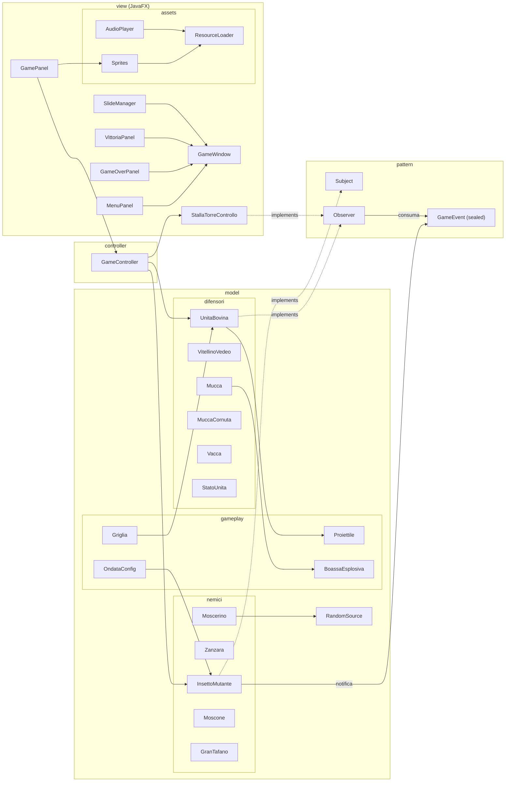
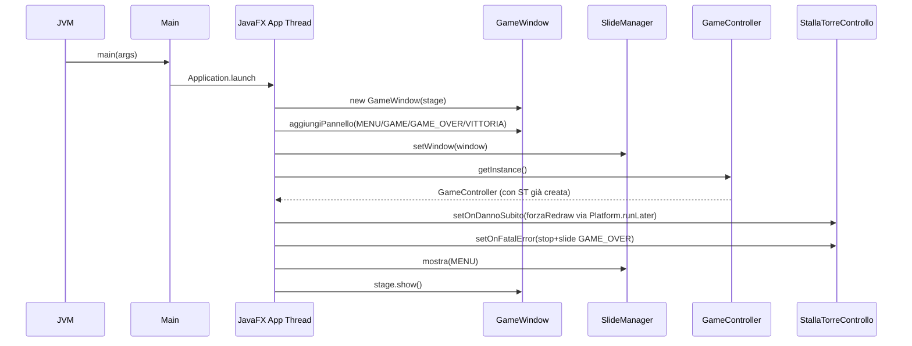
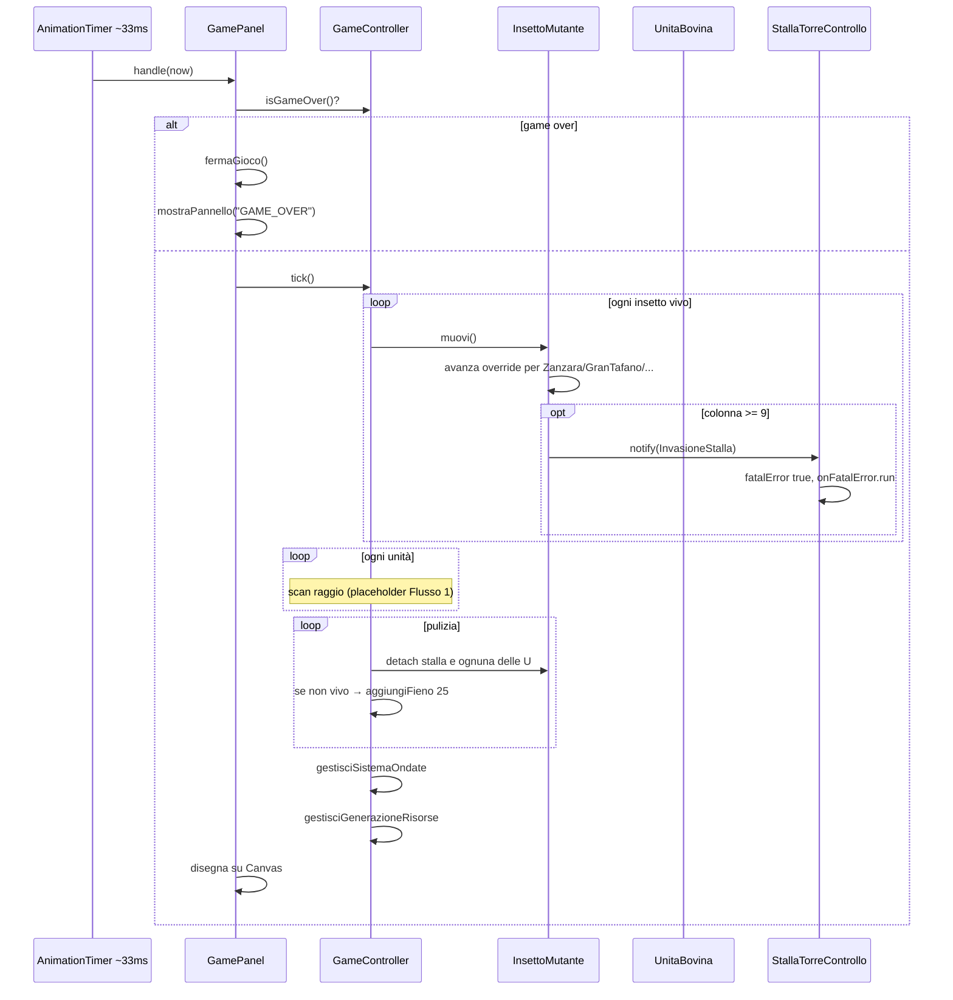
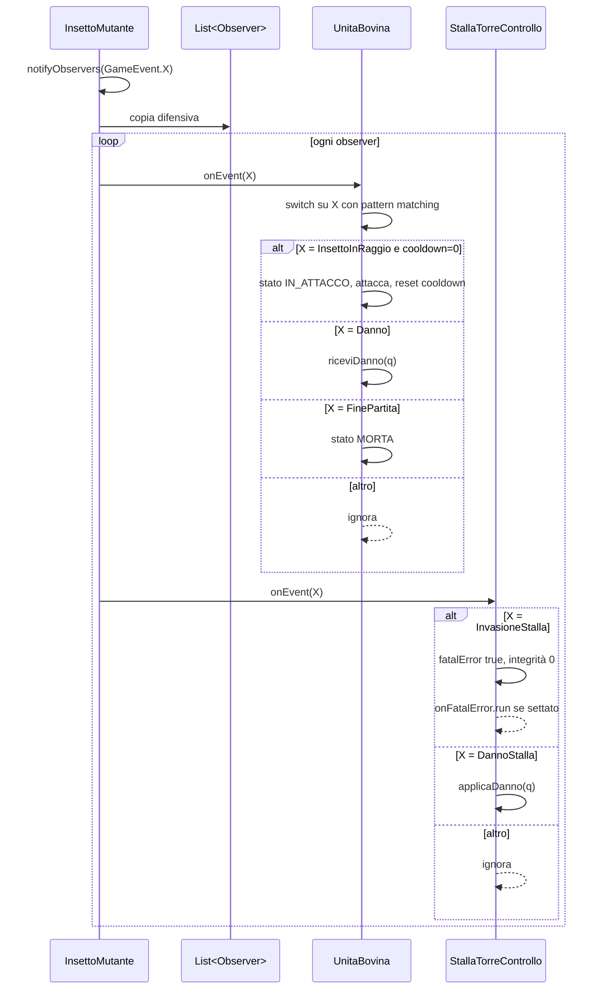
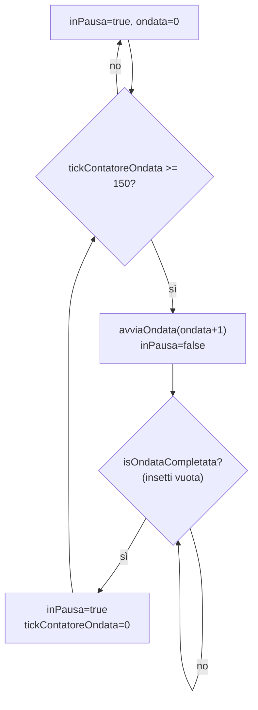
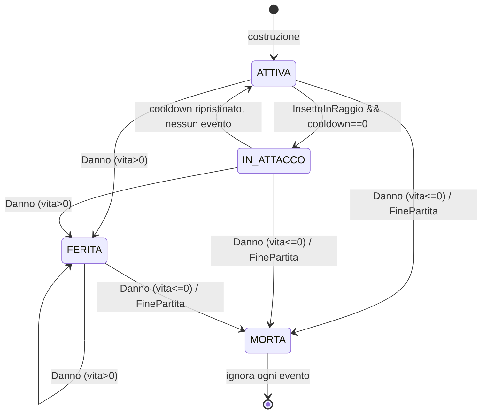
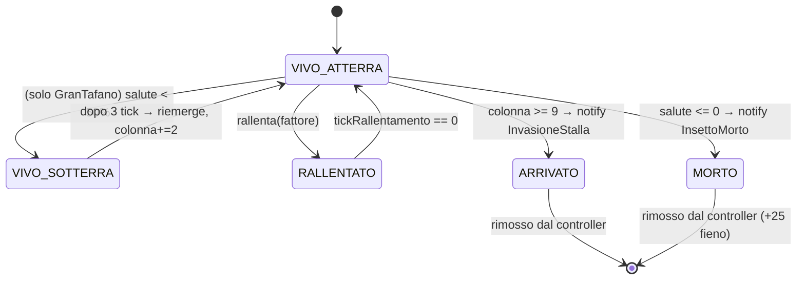

# Documentazione tecnica — Mucche alla Riscossa

> Documento di riferimento interno al progetto. Descrive l'architettura, i
> singoli moduli, i pattern di design adottati, i flussi di gioco e le scelte
> implementative non ovvie. È pensato per affiancare la lettura del codice:
> ogni concetto è ancorato a classi, metodi e numeri di riga concreti.

Indice:

1. [Sguardo d'insieme](#1-sguardo-dinsieme)
2. [Struttura del repository e build](#2-struttura-del-repository-e-build)
3. [Architettura MVC e diagramma dei package](#3-architettura-mvc-e-diagramma-dei-package)
4. [Modello di dominio](#4-modello-di-dominio)
   - 4.1 [Pattern: `Subject` / `Observer` / `GameEvent`](#41-pattern-subject--observer--gameevent)
   - 4.2 [`UnitaBovina` e le mucche concrete](#42-unitabovina-e-le-mucche-concrete)
   - 4.3 [`InsettoMutante` e gli insetti concreti](#43-insettomutante-e-gli-insetti-concreti)
   - 4.4 [Gameplay: `Griglia`, `Proiettile`, `BoassaEsplosiva`, `OndataConfig`](#44-gameplay-griglia-proiettile-boassaesplosiva-ondataconfig)
   - 4.5 [`RandomSource`: aleatorietà testabile](#45-randomsource-aleatorietà-testabile)
5. [Controller](#5-controller)
6. [View (Swing) e asset](#6-view-swing-e-asset)
7. [Design pattern adottati](#7-design-pattern-adottati)
8. [Flussi di gioco e diagrammi di sequenza](#8-flussi-di-gioco-e-diagrammi-di-sequenza)
9. [Modello degli eventi (state diagram)](#9-modello-degli-eventi-state-diagram)
10. [Strategia di test](#10-strategia-di-test)
11. [Decisioni progettuali e trade-off](#11-decisioni-progettuali-e-trade-off)
12. [Estensibilità e punti aperti (TODO)](#12-estensibilità-e-punti-aperti-todo)

---

## 1. Sguardo d'insieme

**Mucche alla Riscossa** è un tower defense bovino scritto in **Java 21**
con interfaccia **Swing**. Il giocatore schiera unità bovine
(`VitellinoVedeo`, `Mucca`, `MuccaCornuta`, `Vacca`) su una griglia 5×10 per
fermare ondate crescenti di insetti mutanti (`Zanzara`, `Moscerino`,
`Moscone`, `GranTafano`). La logica di gioco è retta da un game-loop a tick
(circa 30 FPS, vedi `GamePanel` r. 1962) che muove i nemici, gestisce
attacchi, trappole, generazione passiva di "balle di fieno" e progressione
delle ondate.

Il fil rouge architetturale è il pattern **Observer** in forma type-safe:
gli `InsettoMutante` sono `Subject`, mucche e stalla sono `Observer`, e gli
eventi viaggiano come `GameEvent` (sealed interface + record), eliminando
qualunque protocollo a stringhe.

---

## 2. Struttura del repository e build

```text
mucche-alla-riscossa/
├── pom.xml                       Maven, JDK 21, JUnit 5.11.3
├── README.md                     panoramica, regole di gioco, build
├── LICENSE
├── docs/
│   ├── uml.md                    UML sintetico (mermaid)
│   └── CODEBASE.md               questo documento
├── .github/workflows/ci.yml      CI: build + test su Ubuntu / JDK 21
├── src/main/java/MuccheAllaRiscossa/
│   ├── Main.java
│   ├── controller/GameController.java
│   ├── pattern/                  Observer, Subject, GameEvent
│   ├── model/
│   │   ├── RandomSource.java
│   │   ├── difensori/            UnitaBovina + 4 mucche + StatoUnita
│   │   ├── nemici/               InsettoMutante + 4 insetti
│   │   └── gameplay/             Griglia, Proiettile, BoassaEsplosiva, OndataConfig
│   └── view/
│       ├── GameWindow, *Panel    JFrame + CardLayout
│       ├── SlideManager.java     navigazione fra schermate (Singleton)
│       ├── StallaTorreControllo  Observer del game state
│       └── assets/               ResourceLoader, Sprites, AudioPlayer
└── src/test/java/                JUnit 5 (controller, integration, model, view/assets)
```

Build & run (vedi `pom.xml` e README):

```bash
mvn compile      # compila
mvn test         # esegue tutti i test JUnit 5
mvn exec:java    # avvia il gioco (entry point: MuccheAllaRiscossa.Main)
```

`pom.xml` definisce `maven.compiler.source/target = 21` (necessario perché
si usa il `switch` con pattern matching su sealed interface, GA in 21) e
include `junit-jupiter-params` per i test parametrici di `OndataConfig`.

---

## 3. Architettura MVC e diagramma dei package

L'organizzazione segue il triplete classico **Model / View / Controller**,
con l'aggiunta di un pacchetto `pattern` che ospita le interfacce
Observer/Subject e il tipo evento `GameEvent`:



La dipendenza è unidirezionale: `view -> controller -> model`. Il modello
**non** importa Swing. La view legge lo stato del modello via getter del
`GameController` e installa callback (`Runnable`) per reagire ai danni e al
fatal error (`Main.java` r. 41–50).

---

## 4. Modello di dominio

### 4.1 Pattern: `Subject` / `Observer` / `GameEvent`

Tre file, un solo concetto: chi pubblica eventi (`Subject`) e chi li
consuma (`Observer`) scambiano oggetti **tipizzati** anziché stringhe.

`pattern/GameEvent.java` è una **sealed interface** che enumera i nove
record-evento possibili (r. 99–127):

```java
public sealed interface GameEvent {
    record InsettoInRaggio(int rigaInsetto, double colonnaInsetto) implements GameEvent {}
    record Danno(int quantita)                                    implements GameEvent {}
    record FinePartita()                                          implements GameEvent {}
    record InvasioneStalla(String tipoInsetto, int idInsetto)     implements GameEvent {}
    record InsettoMorto(String tipoInsetto, int idInsetto)        implements GameEvent {}
    record DannoStalla(int quantita)                              implements GameEvent {}
    record TafanoScava(int idInsetto, boolean sotterraneo)        implements GameEvent {}
    record ZanzaraInVolo(int idInsetto, int riga)                 implements GameEvent {}
    record MoscerinoEvade(int idInsetto)                          implements GameEvent {}
}
```

Vantaggi rispetto al protocollo a stringhe (`"DANNO:50"`) commentato come
abbandonato nel javadoc:

- **Tipo-sicurezza**: niente `Integer.parseInt` con `try/catch` a runtime.
- **Pattern matching esaustivo** nei consumatori (`switch` su sealed).
- **Estensibilità**: aggiungere un evento è additivo; chi non lo gestisce
  lo riceve nel ramo `default` e lo ignora.
- **Immutabilità** garantita dai `record`.

`pattern/Subject.java` è minimale e definisce solo `attach/detach/notifyObservers(GameEvent)`.
Le implementazioni reali stanno in `InsettoMutante` (§4.3).

`pattern/Observer.java` espone l'unico metodo `onEvent(GameEvent)`. Il
javadoc raccomanda di usare `switch` con pattern matching e di ignorare gli
eventi non rilevanti: è esattamente quello che fanno `UnitaBovina.onEvent`
(r. 894–910) e `StallaTorreControllo.onEvent` (r. 1582–1597).

### 4.2 `UnitaBovina` e le mucche concrete

`model/difensori/UnitaBovina.java` è la classe astratta base. Estratti
significativi:

- ID immutabile generato thread-safe: `protected final int id = NEXT_ID.getAndIncrement();`
  con `AtomicInteger NEXT_ID` statico (r. 808). Garantisce univocità anche
  in scenari multi-thread (Swing EDT + eventuali test paralleli).
- Stato esplicito tramite enum `StatoUnita` (`ATTIVA`, `IN_ATTACCO`,
  `FERITA`, `MORTA`).
- Cooldown di attacco gestito a tick (`cooldownMax = 3` di default, r. 852);
  `tick()` decrementa il contatore (r. 880–884).
- `onEvent(GameEvent)` esegue il dispatch:
  - `InsettoInRaggio` → se `cooldown == 0`, passa in `IN_ATTACCO`, chiama
    il template method astratto `attacca()`, reimposta il cooldown.
  - `Danno` → applica `riceviDanno(quantita)`.
  - `FinePartita` → stato `MORTA`, non risponde più ad alcun evento.
  - default → ignorato (estensibilità).
- Una unità `MORTA` ignora qualunque evento successivo (guard a r. 895).

`attacca()` è il **template method**: ogni mucca lo specializza.

| Classe | Costo | Raggio | Vita | Cooldown | Comportamento `attacca()` |
|---|---|---|---|---|---|
| `VitellinoVedeo` | 50 | 5.0 | 100 | 3 | crea un `Proiettile` `colpisceTutti=false` (r. 765–771) |
| `Mucca` (Beatrice) | 75 | 1.0 | 150 | 3 | piazza una `BoassaEsplosiva` davanti (r. 1008–1018) |
| `MuccaCornuta` | 125 | 0.5 | 300 | 3 | `incorna()` corpo a corpo (r. 956–963); l'overload `incorna(InsettoMutante)` applica `dannoCarica = 80` |
| `Vacca` | 200 | 8.0 | 200 | 3 | lancia un `Proiettile` `colpisceTutti=true` a velocità 15 (r. 1075–1086) |

Citazione utile: il `VitellinoVedeo` espone l'ultimo proiettile creato
come stato osservabile per la view e i test (r. 775); lo stesso vale per
`Vacca.getUltimoProiettile()` (r. 1089) e `Mucca.getUltimaTrappola()` (r. 1021).
Questa scelta evita un canale di comunicazione separato (es. event bus per
i proiettili) a costo di una piccola accoppiatura temporale: il controller
deve leggere lo stato prima dell'attacco successivo.

### 4.3 `InsettoMutante` e gli insetti concreti

`model/nemici/InsettoMutante.java` è il **Subject** concreto del gioco.
Punti salienti:

- ID univoco analogo a `UnitaBovina` (r. 1172).
- `colonna` è `double` perché un insetto si muove a frazione di cella per
  tick (es. zanzara 0.6/tick, r. 1322); la "stalla" è la colonna 9
  (`COLONNA_STALLA`, r. 1250).
- `muovi()` (r. 1241–1247) fa la guard e delega al template method
  `avanza()`. Quando `colonna >= 9` chiama `setArrivato()`, che notifica
  `GameEvent.InvasioneStalla(tipo, id)`.
- `avanza()` di default gestisce il rallentamento: se `tickRallentamento > 0`
  usa `velocita` ridotta, decrementa il contatore, e al termine ripristina
  `velocitaBase` (r. 1257–1268).
- `subisciDanno(int)` riduce `salute` e, se va a zero, notifica
  `GameEvent.InsettoMorto(tipo, id)` (r. 1277–1282).
- `rallenta(double)` imposta `velocita = velocitaBase * fattore` e
  `tickRallentamento = 5` (r. 1288–1293).
- `notifyObservers` itera **su una copia** della lista, in modo che un
  observer possa rimuoversi durante il callback senza
  `ConcurrentModificationException` (r. 1227–1232).

Specializzazioni:

- **`Zanzara`** (40 hp, velocità 0.6): override `avanza()` chiama
  `volaOltreBalle()` ad ogni tick e poi `super.avanza()` (r. 1331–1335);
  notifica `GameEvent.ZanzaraInVolo`.
- **`Moscerino`** (25 hp, velocità 0.8): override `subisciDanno(int)`
  estrae un `random.nextDouble()`; se < `PROB_EVASIONE = 0.30` il danno è
  annullato e viene pubblicato `GameEvent.MoscerinoEvade(id)` (r. 1133–1140).
  La `RandomSource` è iniettabile dal costruttore (§4.5).
- **`Moscone`** (200 hp, velocità 0.2): override `subisciDanno(int)`
  riduce il danno di `spessoreGuscioNoce = 10` con clamp a 0 (r. 1370–1375).
- **`GranTafano`** (400 hp, velocità 0.3): boss. Quando `salute <
  saluteIniziale / 2` chiama `scava()` ed entra in stato sotterraneo. Sotto
  terra resta 3 tick: poi `scava()` lo riemerge e `colonna += 2.0` (salto
  di due colonne in avanti, r. 1411–1433). Mentre `isSotterraneo`,
  `subisciDanno` è una no-op (r. 1446–1453).

### 4.4 Gameplay: `Griglia`, `Proiettile`, `BoassaEsplosiva`, `OndataConfig`

**`Griglia`** (`model/gameplay/Griglia.java`): tabellone 5×10 (`RIGHE = 5`,
`COLONNE = 10`, r. 449–450). Espone `isCellaLibera`, `occupa`, `libera`,
`getUnitaInCella`. Le operazioni fuori bounds sono **silenti** (no-op /
ritornano `null` o `false`, r. 484–486), per resistenza alla GUI che
potrebbe tradurre clic fuori area.

**`Proiettile`** (`model/gameplay/Proiettile.java`):

- 5 campi: `danno`, `velocita`, `riga` (int), `colonna` (double),
  `colpisceTutti` (bool), `attivo` (bool).
- `muovi()` somma `velocita` alla colonna; se esce dalla griglia
  (`colonna >= COLONNE = 10`) si disattiva (r. 528–534).
- `segnaColpito()` disattiva il proiettile **solo se** non è
  `colpisceTutti`; in caso contrario continua a viaggiare lungo la corsia
  (uso tipico: il "lancio del vitello" della `Vacca`).

**`BoassaEsplosiva`** (`model/gameplay/BoassaEsplosiva.java`): trappola
piazzata dalla `Mucca`. Il metodo `attiva(InsettoMutante)`:

- è idempotente: una boassa già consumata o un insetto `null` lasciano lo
  stato invariato (r. 707–717);
- applica `subisciDanno(danno)` e `rallenta(rallentamento)` all'insetto;
- consuma sé stessa (`attiva = false`).

**`OndataConfig`** (`model/gameplay/OndataConfig.java`): factory di livelli
tramite `creaOndata(int livello)` (r. 597). 5 livelli predefiniti più un
caso `default` per livelli oltre il quinto. Caratteristiche garantite e
validate dai test parametrici:

- numero insetti monotonicamente non decrescente da un livello al successivo;
- delay tra spawn monotonicamente non crescente (`8 → 6 → 5 → 4 → 3`);
- livello 3 introduce il `Moscone`;
- livello 5 contiene almeno un `GranTafano`;
- livello > 5 genera 2×`RIGHE` insetti (10) tutti tra `GranTafano` e `Moscone`.

### 4.5 `RandomSource`: aleatorietà testabile

`model/RandomSource.java` è un'interfaccia funzionale (`@FunctionalInterface`)
con un solo metodo `double nextDouble()`. Due implementazioni di comodo:

```java
RandomSource DEFAULT = RandomGenerator.getDefault()::nextDouble;
static RandomSource fixed(double value) { return () -> value; }
```

Iniettare la sorgente di randomicità nel `Moscerino` permette ai test di
forzare entrambi i rami della decisione probabilistica (vedi
`MoscerinoTest`). È il motivo per cui esistono **due costruttori** della
classe: uno pubblico semplice e uno "di test" che accetta la sorgente
(r. 1118–1127).

---

## 5. Controller

`controller/GameController.java` è l'**unico** punto di gestione delle
risorse, della schiera e dell'ondata. Implementa il Singleton con
**Initialization-on-demand holder** (r. 173–175):

```java
private static final class Holder {
    private static final GameController INSTANCE = new GameController();
}
public static GameController getInstance() { return Holder.INSTANCE; }
```

Vantaggio: lazy, thread-safe per garanzia di classloader, senza il costo
di `synchronized`.

### 5.1 Stato interno

Tutti i campi sono `private`; le liste sono esposte come
`Collections.unmodifiableList` (r. 330–331) per impedire mutazioni esterne.
Lo stato iniziale è:

| Campo | Valore iniziale | Significato |
|---|---|---|
| `balleDiFieno` | 100 | risorsa per schierare unità |
| `saluteStalla` | 100 | duplicato logico (la stalla vera è `StallaTorreControllo`) |
| `ondataCorrente` | 0 | nessuna ondata ancora avviata |
| `tickContatoreOndata` | 0 | tick passati dall'ultimo cambio di fase |
| `inPausa` | true | la partita parte sempre in pausa preparazione |
| `tickRisorse` | 0 | contatore per il +10 fieno passivo |
| `fienoPerUccisione` | 25 | premio per insetto eliminato |

Le liste `proiettili` e `trappole` sono `List<Object>` come placeholder
temporaneo, in attesa del merge del "Flusso 1" (vedi commento r. 184–188 e
§12 — punti aperti). I `Proiettile`/`BoassaEsplosiva` reali sono già
generati dalle mucche ma vengono raccolti tramite getter dedicati sulle
unità anziché tramite il controller.

### 5.2 Operazioni principali

- `aggiungiFieno(int)` / `sottraiFieno(int)`: la sottrazione è atomica con
  guard (`if (qta > balleDiFieno) return false;`, r. 226).
- `schiera(UnitaBovina, riga, colonna)`: spende il fieno, posiziona
  l'unità e la collega come **observer** a ogni insetto già in campo nella
  stessa corsia (r. 243–253). Non controlla l'occupazione della cella
  (`Griglia.isCellaLibera`): è un limite noto.
- `aggiungiInsetto(InsettoMutante)`: aggiunge l'insetto e gli collega come
  observer la stalla **più** tutte le unità sulla stessa riga (r. 261–267).
- `tick()` (r. 277–325) esegue:
  1. `muovi()` su tutti gli insetti (iterando su copia per consentire
     rimozioni indotte);
  2. *placeholder* per scan dei raggi d'azione (sarà completato col Flusso 1);
  3. *placeholder* per le collisioni con boasse;
  4. pulizia: rimuove insetti morti o arrivati, li `detach` dalle unità e
     dalla stalla, premia il giocatore con 25 fieno se l'insetto è morto;
     rimuove le mucche con `!isViva()`;
  5. `gestisciSistemaOndate()` + `gestisciGenerazioneRisorse()`.
- `gestisciSistemaOndate()` (r. 365–380): macchina a stati a 2 stati
  (`inPausa` true/false). 150 tick di pausa (~5 secondi a 30 FPS) prima di
  avviare l'ondata successiva; quando l'ondata è completata (insetti
  vuoti) si rientra in pausa.
- `gestisciGenerazioneRisorse()` (r. 401–407): ogni 150 tick aggiunge +10
  fieno passivo.
- `calcolaDistanza(UnitaBovina, InsettoMutante)`: distanza euclidea tra le
  coordinate `(colonna, riga)` (r. 355–360). Trattate come cartesiane
  discrete.
- `resetForTesting()` (r. 336–351): riporta fieno, salute, liste, contatori
  e flag di pausa allo stato iniziale. Lascia inalterato lo stato della
  `StallaTorreControllo` (campo `final`): i test che vogliono una stalla
  "fresca" devono istanziarne una nuova. Questo limite è documentato nel
  metodo stesso.

`isGameOver()` delega a `stalla.isFatalError()` (r. 327): la verità sul
game over vive nell'observer, non in un flag duplicato del controller.

---

## 6. View (Swing) e asset

### 6.1 `GameWindow` e `SlideManager`

`view/GameWindow.java` è un `JFrame` 1024×600 non ridimensionabile, con
`CardLayout` (r. 2076–2079). Espone `mostraPannello(String)` per cambiare
slide. I quattro pannelli (`MenuPanel`, `GamePanel`, `GameOverPanel`,
`VittoriaPanel`) vengono registrati in `Main` con chiavi
`MENU/GAME/GAME_OVER/VITTORIA` (r. 29–32).

`view/SlideManager.java` è un **Singleton lazy** classico
(`getInstance()` synchronized, r. 1640) con un enum `Slide` che mappa i
nomi logici delle schermate. Funge da indirezione fra la logica di gioco e
il nome stringa nel `CardLayout`, riducendo l'accoppiamento.

### 6.2 `StallaTorreControllo`

Sebbene viva nel package `view`, è prima di tutto un `Observer` del
modello. Mantiene:

- `integritaSistema` (0..100),
- `fatalError` (bool),
- due `Runnable` opzionali (`onDannoSubito`, `onFatalError`) iniettati da
  `Main`.

Logica di `onEvent` (r. 1582–1597):

- `InvasioneStalla` → fatal error immediato, integrità a 0, callback;
- `DannoStalla(q)` → riduce l'integrità con clamp a 0, richiama il callback
  di refresh, e se va a zero scatena il fatal error;
- qualsiasi altro evento è ignorato (stalla non è interessata, ad es., agli
  zig-zag del moscerino).

I due `Runnable` sono il ponte fra modello e GUI: `Main` li imposta
(r. 41–50) per fare `repaint()` sull'HUD e per `fermaGioco()` +
`mostra(GAME_OVER)` quando la stalla muore.

### 6.3 `GamePanel`

È il cuore della GUI di partita. Definisce:

- costanti di layout: 5×10 celle da 80×80 px, offset (50, 100);
- un `MouseAdapter` che traduce il click in coordinate (riga, colonna) per
  il futuro piazzamento del difensore (r. 1943–1959 — attualmente solo
  log, vedi §12);
- il game loop: `gameTimer = new Timer(33, …)` (~30 FPS, r. 1962). Ad ogni
  tick controlla `GameController.isGameOver()`, chiama `gc.tick()`,
  `repaint()`.

`paintComponent` disegna in tre passi (r. 1987–2047):

1. **HUD** (fascia scura in alto): fieno, integrità stalla, ondata,
   indicatore `[PAUSA PREPARAZIONE]` se in pausa.
2. **Griglia a scacchiera**: due tonalità di verde alternate; la riga
   centrale (`r == 2`) è marrone come "sentiero di terra".
3. **Sprite** delle unità e dei nemici via `Sprites.of(...)` (vedi §6.4).

### 6.4 Asset (`view/assets/`)

- **`ResourceLoader`**: carica PNG da `/sprites/<nome>.png` sul classpath
  con cache (`HashMap`). Se l'asset manca genera un **placeholder
  procedurale** 64×64 con rettangolo arrotondato colorato + iniziale
  (r. 1751–1766). L'invariante è "la GUI funziona anche senza asset
  reali", verificato dal test `ResourceLoaderTest`.
- **`Sprites`**: mappa il *tipo dinamico* delle entità del modello allo
  sprite corretto via `switch` su pattern. Approfittando del pattern
  matching su classi (Java 21), evita catene di `instanceof` (r. 1831–1848).
- **`AudioPlayer`**: riproduzione fire-and-forget tramite
  `javax.sound.sampled`. Cattura qualsiasi eccezione e si limita a un
  log: l'audio mancante non deve mai rompere la partita (r. 1789–1800).

---

## 7. Design pattern adottati

| Pattern | Dove | Note |
|---|---|---|
| **Singleton (holder)** | `GameController` (r. 173–175) | Lazy, thread-safe senza `synchronized`. |
| **Singleton (lazy sync)** | `SlideManager.getInstance()` (r. 1640) | Forma più tradizionale, accettabile vista la rarità di chiamata. |
| **Observer** | `InsettoMutante` (Subject), `UnitaBovina` + `StallaTorreControllo` (Observer) | Eventi tipizzati. |
| **Template Method** | `UnitaBovina.attacca()` e `InsettoMutante.avanza()` | Astratti / virtuali specializzati dalle sottoclassi. |
| **Factory method** | `OndataConfig.creaOndata(int)` (r. 597) | Costruzione configurata in base al livello. |
| **Strategy (via SAM)** | `RandomSource` | Strategia di estrazione casuale iniettabile. |
| **Sealed type + pattern matching** | `GameEvent` | Sostituisce un protocollo a stringhe con tipi esaustivi. |
| **MVC** | strutturale | `view → controller → model`. |
| **Callback / Observer "leggero"** | `Runnable` su `StallaTorreControllo` | Ponte fra modello e Swing senza dipendenza diretta. |
| **CardLayout + Singleton facade** | `GameWindow` + `SlideManager` | Navigazione fra schermate. |

---

## 8. Flussi di gioco e diagrammi di sequenza

### 8.1 Boot dell'applicazione



### 8.2 Un tick di gioco



### 8.3 Pubblicazione di un evento



### 8.4 Ciclo di vita di un'ondata



---

## 9. Modello degli eventi (state diagram)

Stato di una `UnitaBovina`:



Stato di un `InsettoMutante` (visto come Subject + macchina di
posizione/salute):



---

## 10. Strategia di test

Suite JUnit 5 (con `junit-jupiter-params`) divisa per package:

| Test class | Cosa verifica |
|---|---|
| `GameControllerTest` | risorse, schieramento, lista immutabile, tick, ondate, generazione risorse, distanza, costanti griglia |
| `ObserverFlowIntegrationTest` | flusso end-to-end Subject↔Observer fra mucche, insetti, stalla e controller |
| `ProiettileTest` | avanzamento, uscita dalla griglia, colpo singolo vs multi-target, proiettile inattivo |
| `GrigliaTest` | celle libere/occupate, libera, fuori bounds silenti |
| `OndataConfigTest` | livelli 1..5 parametrici, monotonia difficoltà, presenza Moscone/GranTafano, livello brutale |
| `BoassaEsplosivaTest` | attivazione, robustezza a `null`, idempotenza |
| `UnitaBovinaTest` | template method, cooldown, eventi rilevanti vs ignorati, id univoci |
| `MoscerinoTest` | rami della decisione casuale con `RandomSource.fixed` |
| `InsettoMutanteTest` | movimento, morte, attach/detach, rallentamento, Moscone, GranTafano sotterraneo |
| `ResourceLoaderTest` | placeholder 64×64, cache per chiave, audio assente, mapping sprite non-null |

Tecniche notevoli:

- **Determinismo**: `RandomSource.fixed(...)` per testare entrambi i rami
  del moscerino.
- **Spy observer** anonimo (`SpyObserver`) usato in `InsettoMutanteTest` e
  `MoscerinoTest` per accumulare gli eventi ricevuti e verificarne tipo /
  cardinalità.
- **Reset esplicito** del Singleton via `GameController.resetForTesting()`
  in `@BeforeEach`, eseguito **nello stesso package** del controller per
  ragioni di visibilità (vedi javadoc del test).
- **Test parametrici** in `OndataConfigTest` con `@ValueSource` e
  `@CsvSource`.

---

## 11. Decisioni progettuali e trade-off

1. **Singleton via holder vs `synchronized`**. Il `GameController` adotta
   il pattern Initialization-on-demand holder (classe statica privata
   `Holder`) per ottenere lazy + thread-safety gratis dal classloader.
   `SlideManager`, di minore impatto, usa la forma più classica
   `synchronized getInstance()`.
2. **Eventi tipizzati vs stringhe**. La sealed interface `GameEvent` è
   stata introdotta proprio per eliminare l'antipattern `"DANNO:50"`. Il
   compilatore garantisce che ogni `switch` con tutti i pattern sia
   esaustivo; il `default` è esplicito quando si vuole ignorare
   silenziosamente eventi non rilevanti (vedi `UnitaBovina.onEvent`
   r. 908). Questa fu la motivazione del bump a Java 21 (commit `aadf00b`).
3. **`colonna` come `double`**. Permette movimento sub-cella per
   simulare insetti veloci/lenti. Le mucche, ferme, usano `int`.
4. **`Runnable` come ponte verso Swing**. La stalla non importa Swing: si
   limita a invocare due `Runnable` opzionali. È un mini-Observer "ad hoc"
   che disaccoppia il modello dal framework grafico.
5. **Liste di gioco immutabili all'esterno**. `getUnita()` e `getInsetti()`
   ritornano viste `unmodifiableList`. Il test
   `getUnitaRitornaListaImmodificabile` lo cristallizza come invariante.
6. **Robustezza ai dati assenti**. `ResourceLoader` genera un placeholder
   piuttosto che lanciare un'eccezione; `AudioPlayer` ingoia silenziosamente
   gli errori. La conseguenza è che il gioco gira anche prima di aggiungere
   asset reali (utile in CI e in headless).
7. **Iterazione su copia in `notifyObservers`**. Un observer potrebbe
   `detach`-arsi durante il proprio `onEvent` (es. un'unità che muore in
   risposta a un danno); la copia della lista impedisce
   `ConcurrentModificationException`.
8. **Premio fieno solo per uccisione, non per arrivo**. Nel `tick` (r. 312–315)
   il bonus +25 è applicato unicamente se `!i.isVivo()`. Se l'insetto è
   semplicemente arrivato alla stalla, non c'è ricompensa: la stalla va in
   fatal error.
9. **`schiera` non controlla `Griglia`**. Volontaria scelta minimalista in
   questa iterazione: il controller mantiene le mucche in una `List`, non
   in una matrice di celle. La `Griglia` esiste già e i suoi test la
   coprono, ma il wiring con `schiera` è demandato all'integrazione del
   "Flusso 1".
10. **Mucche aliene a Swing**. Tutto il package `model` non importa nulla
    di `javax.swing` o `java.awt.*`. Solo gli `assets` e la `view`
    dipendono da Swing/AWT.

---

## 12. Estensibilità e punti aperti (TODO)

Marcatori espliciti nel codice:

- `GameController` r. 184–188: liste `proiettili` e `trappole` come
  `List<Object>` placeholder in attesa del merge "Flusso 1". I `Proiettile`
  reali sono già prodotti dalle mucche ma non raccolti dal controller in
  questa iterazione; vengono esposti via `getUltimoProiettile()` per i test.
- `GameController.tick` r. 286–292: il loop "calcola distanza < raggio →
  evento `InsettoInRaggio` → cooldown unità" è progettato ma il passaggio
  effettivo dell'evento è demandato all'integrazione completa.
- `GameController.avviaOndata` r. 385–389: chiamata in piedi, ma non
  istanzia ancora gli insetti dall'`OndataConfig`. La factory esiste già
  (`OndataConfig.creaOndata(numero)`), il wiring con il timer di spawn è il
  pezzo mancante.
- `GamePanel` r. 1955–1957: il click attualmente logga la cella ma non
  schiera; manca la selezione del difensore (HUD) e la chiamata a
  `GameController.schiera(...)`.
- `GameOverPanel` r. 1540–1541: il pulsante "Riprova" cambia slide ma non
  reimposta lo stato del Singleton. Per ripartire da capo sarà necessario
  invocare un futuro reset pubblico (oggi `resetForTesting` è destinato
  solo ai test).
- `SlideManager` r. 1680–1682: la slide `PAUSA` è dichiarata nell'enum ma
  il pannello non è ancora implementato.

Aree naturali di estensione, indicate dal design:

- aggiungere nuovi nemici/mucche basta estendere le rispettive astratte e
  registrare lo sprite in `Sprites.of(...)`;
- nuovi eventi: aggiungere un `record` a `GameEvent` e gestirlo dove serve,
  ignorandolo altrove grazie al `default`;
- bilanciamento ondate: tutto centralizzato in `OndataConfig.creaOndata`;
- nuove sorgenti di randomicità (es. seed riproducibile per replay):
  bastano implementazioni alternative di `RandomSource`.
