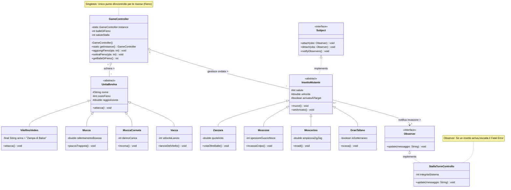

```mermaid

classDiagram
    %% --- PATTERN SINGLETON ---
    class GameController {
        -static GameController instance
        -int balleDiFieno
        -int saluteStalla
        -GameController()
        +static getInstance() GameController
        +aggiungiFieno(qta: int) void
        +sottraiFieno(qta: int) void
        +getBalleDiFieno() int
    }

    %% --- PATTERN OBSERVER ---
    class Subject {
        <<interface>>
        +attach(obs: Observer) void
        +detach(obs: Observer) void
        +notifyObservers() void
    }

    class Observer {
        <<interface>>
        +update(messaggio: String) void
    }

    class StallaTorreControllo {
        -int integritaSistema
        +update(messaggio: String) void
    }

    %% --- DIFENSORI (RESISTENZA BOVINA) ---
    class UnitaBovina {
        <<abstract>>
        #String nome
        #int costoFieno
        #double raggioAzione
        +attacca() void*
    }

    class VitellinoVedeo {
        -final String arma = "Zampa di Balsa"
        +attacca() void
    }

    class Mucca {
        -double rallentamentoBoassa
        +piazzaTrappola() void
    }

    class MuccaCornuta {
        -int dannoCarica
        +incorna() void
    }

    class Vacca {
        -int velocitaLancio
        +lancioDelVitello() void
    }

    %% --- NEMICI (INSETTI MUTANTI) ---
    class InsettoMutante {
        <<abstract>>
        #int salute
        #double velocita
        #boolean arrivatoAlTarget
        +muovi() void
        +setArrivato() void
    }

    class Zanzara {
        -double quotaVolo
        +volaOltreBalle() void
    }

    class Moscone {
        -int spessoreGuscioNoce
        +incassaColpo() void
    }

    class Moscerino {
        -double ampiezzaZigZag
        +evadi() void
    }

    class GranTafano {
        -boolean isSotterraneo
        +scava() void
    }

    %% --- RELAZIONI ---
    %% Generalizzazioni (Ereditarietà)
    UnitaBovina <|-- VitellinoVedeo
    UnitaBovina <|-- Mucca
    UnitaBovina <|-- MuccaCornuta
    UnitaBovina <|-- Vacca

    InsettoMutante <|-- Zanzara
    InsettoMutante <|-- Moscone
    InsettoMutante <|-- Moscerino
    InsettoMutante <|-- GranTafano

    %% Realizzazioni (Interfacce)
    Subject <|.. InsettoMutante : implements
    Observer <|.. StallaTorreControllo : implements

    %% Associazioni e Molteplicità
    GameController "1" o-- "*" UnitaBovina : schiera >
    GameController "1" o-- "*" InsettoMutante : gestisce ondata >
    InsettoMutante "0..*" --> "1" Observer : notifica invasione >
    
    note for GameController "Singleton: Unico punto di\ncontrollo per le risorse (Fieno)"
    note for StallaTorreControllo "Observer: Se un insetto arriva,\nscatta il Fatal Error"
```
