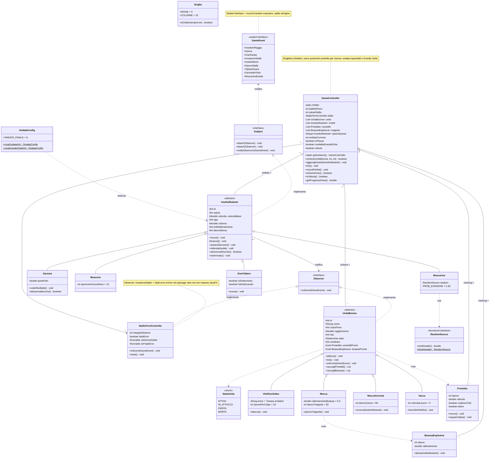

```mermaid

classDiagram
    %% --- PATTERN SINGLETON ---
    class GameController {
        -static Holder
        -int balleDiFieno
        -int saluteStalla
        -StallaTorreControllo stalla
        -List~UnitaBovina~ unita
        -List~InsettoMutante~ insetti
        -List~Proiettile~ proiettili
        -List~BoassaEsplosiva~ trappole
        -Deque~InsettoMutante~ spawnQueue
        -int ondataCorrente
        -boolean inPausa
        -boolean modalitaGrandeOrda
        -boolean vittoria
        +static getInstance() GameController
        +schiera(UnitaBovina, int, int) boolean
        +aggiungiInsetto(InsettoMutante) void
        +tick() void
        +nuovaPartita() void
        +isGameOver() boolean
        +isVittoria() boolean
        +getProgressoFase() double
    }

    %% --- PATTERN OBSERVER + SEALED EVENT ---
    class Subject {
        <<interface>>
        +attach(Observer) void
        +detach(Observer) void
        +notifyObservers(GameEvent) void
    }

    class Observer {
        <<interface>>
        +onEvent(GameEvent) void
    }

    class GameEvent {
        <<sealed interface>>
        +InsettoInRaggio
        +Danno
        +FinePartita
        +InvasioneStalla
        +InsettoMorto
        +DannoStalla
        +TafanoScava
        +ZanzaraInVolo
        +MoscerinoEvade
    }

    class StallaTorreControllo {
        -int integritaSistema
        -boolean fatalError
        -Runnable onDannoSubito
        -Runnable onFatalError
        +onEvent(GameEvent) void
        +reset() void
    }

    %% --- DIFENSORI (RESISTENZA BOVINA) ---
    class UnitaBovina {
        <<abstract>>
        #int id
        #String nome
        #int costoFieno
        #double raggioAzione
        #int vita
        #StatoUnita stato
        #int cooldown
        #List~Proiettile~ proiettiliPronti
        #List~BoassaEsplosiva~ boassePronte
        +attacca() void*
        +tick() void
        +onEvent(GameEvent) void
        +raccogliProiettili() List
        +raccogliBoasse() List
    }

    class StatoUnita {
        <<enum>>
        ATTIVA
        IN_ATTACCO
        FERITA
        MORTA
    }

    class VitellinoVedeo {
        -String arma = "Zampa di Balsa"
        -int dannoPerColpo = 20
        +attacca() void
    }

    class Mucca {
        -double rallentamentoBoassa = 0.3
        -int dannoTrappola = 50
        +piazzaTrappola() void
    }

    class MuccaCornuta {
        -int dannoCarica = 80
        +incorna(InsettoMutante) void
    }

    class Vacca {
        -int velocitaLancio = 3
        +lancioDelVitello() void
    }

    %% --- NEMICI (INSETTI MUTANTI) ---
    class InsettoMutante {
        <<abstract>>
        #int id
        #int salute
        #double velocita, velocitaBase
        #int riga
        #double colonna
        #int tickRallentamento
        #int dannoMorso
        +muovi() void
        #avanza() void
        +subisciDanno(int) void
        +rallenta(double) void
        +attraversaMucche() boolean
        +setArrivato() void
    }

    class Zanzara {
        -double quotaVolo
        +volaOltreBalle() void
        +attraversaMucche() boolean
    }

    class Moscone {
        -int spessoreGuscioNoce = 10
    }

    class Moscerino {
        -RandomSource random
        -PROB_EVASIONE = 0.30
    }

    class GranTafano {
        -boolean isSotterraneo
        -boolean haGiaScavato
        +scava() void
    }

    %% --- GAMEPLAY ---
    class Griglia {
        +RIGHE = 5
        +COLONNE = 10
        +isCellaLibera(int,int) boolean
    }
    class Proiettile {
        -int danno
        -double velocita
        -boolean colpisceTutti
        -boolean attivo
        +muovi() void
        +segnaColpito() void
    }
    class BoassaEsplosiva {
        -int danno
        -double rallentamento
        +attiva(InsettoMutante) void
    }
    class OndataConfig {
        +ONDATA_FINALE = 8
        +creaOndata(int) OndataConfig$
        +creaGrandeOrda(int) OndataConfig$
    }

    class RandomSource {
        <<functional interface>>
        +nextDouble() double
        +fixed(double) RandomSource$
    }

    %% --- RELAZIONI ---
    %% Generalizzazioni
    UnitaBovina <|-- VitellinoVedeo
    UnitaBovina <|-- Mucca
    UnitaBovina <|-- MuccaCornuta
    UnitaBovina <|-- Vacca

    InsettoMutante <|-- Zanzara
    InsettoMutante <|-- Moscone
    InsettoMutante <|-- Moscerino
    InsettoMutante <|-- GranTafano

    %% Realizzazioni
    Subject  <|.. InsettoMutante       : implements
    Observer <|.. UnitaBovina          : implements
    Observer <|.. StallaTorreControllo : implements
    GameEvent <.. Subject              : notifies

    %% Associazioni
    GameController "1" o-- "*" UnitaBovina       : schiera >
    GameController "1" o-- "*" InsettoMutante    : ondata >
    GameController "1" o-- "*" Proiettile        : tracking >
    GameController "1" o-- "*" BoassaEsplosiva   : tracking >
    GameController "1" --> "1" StallaTorreControllo
    UnitaBovina ..> StatoUnita
    UnitaBovina ..> Proiettile        : crea
    Mucca       ..> BoassaEsplosiva   : crea
    Moscerino   ..> RandomSource      : usa
    OndataConfig ..> InsettoMutante   : istanzia
    InsettoMutante "0..*" --> "*" Observer : notifica

    note for GameController "Singleton (Holder): unico punto\ndi controllo per risorse, ondate,\nproiettili e Grande Orda."
    note for StallaTorreControllo "Observer: InvasioneStalla -> fatal error.\nVive nel package view ma non importa JavaFX."
    note for GameEvent "Sealed interface + record:\nswitch esaustivo, addio stringhe."
```
